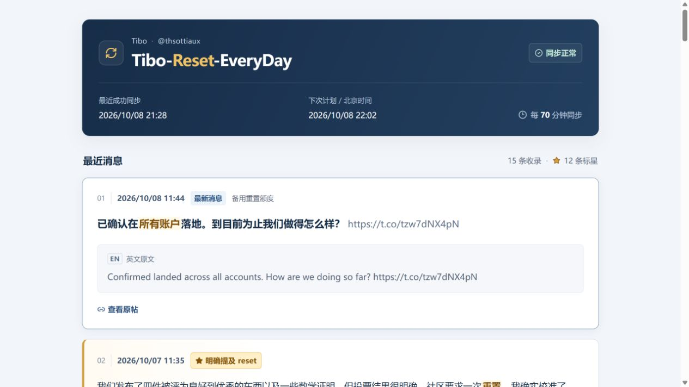
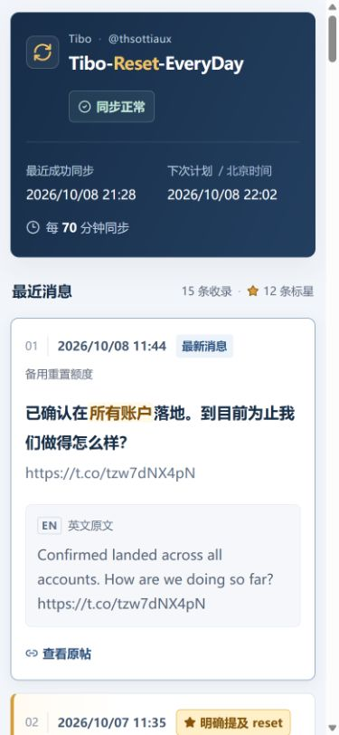

# UI 优化验收记录

日期：2026-10-08

## 变更

- 深色标题区展示最近成功同步、下次计划及每 70 分钟同步的频率。
- 最新消息增加独立标签；reset 消息增加金色星标、侧边线和轻量背景。
- 中文正文突出重置、额度及适用账户等重点词句；正文中的网址降低视觉权重。
- 英文原文使用独立阅读区，与中文同时显示。
- 保留原有时间倒序和消息内容，不因星标或高亮重新排序。

## 验收结果

| 项目 | 结果 |
| --- | --- |
| 桌面 1280 × 720 | 消息与同步信息正常显示，无横向溢出 |
| 手机 390 × 844 | 标题与同步信息自动布局，双语正文完整可读，无横向溢出 |
| 窄屏 320 × 740 | 15 条消息保持正常显示，无横向溢出 |
| 消息保留 | 15 条，12 条 reset 标星，1 条“最新消息”标签 |
| 来源链接 | 15 条原帖链接均指向 Tibo 的 X 消息，使用新窗口打开 |
| 内容重点 | reset 星标与中文关键词高亮可见；间接确认的最新消息没有误加 reset 星标 |
| 数据更新 | 本地真实采集成功，15 条中文与英文均可读 |
| 云端数据 | 查询时最近成功同步为北京时间 2026-10-08 20:51，状态正常、无同步错误 |
| 浏览器运行 | 最终重新加载后，无新增 error / warn 日志 |
| 核心测试 | 12 项全部通过，含去重、排序、双语匹配、失败保留、事务回滚、并发租约及 70 分钟跨小时周期 |
| 类型检查 | TypeScript `--noEmit` 通过 |
| 代码检查 | 本次变更的 ESLint 检查与 `git diff --check` 通过 |

以上消息数量及同步时间为验收时的真实快照，不代表之后一直不变。网站定时任务保留原有每 70 分钟计划。

## 截图

### 桌面

### 手机

